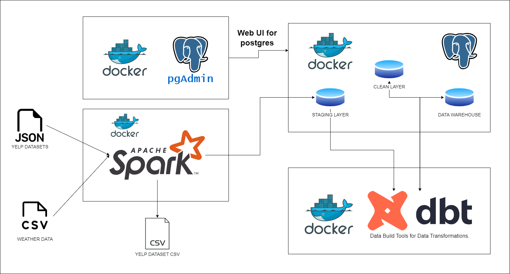

# How Weather Affect Yelp Reviews

My solution to technical test offered by DANA.

## Requirements

- Docker
- Docker compose

**NOTE:** `docker compose` command here uses Docker Compose V2, more info [here](https://docs.docker.com/compose/compose-v2/).

For Windows:

- WSL2 for Docker Desktop Backend

## Services

- Postgres 13 (as a staging database, ODS, and also a Data Warehouse).
- PGAdmin (Web Service UI for postgres).
- Spark (For processing large data)
- PySpark on Python 3.10.7 (For running spark jobs)
- dbt (Data Build Tool for transforming data in Data Warehouse).

**NOTE:** No orchestrator (e.g Apache Airflow) is used in this case for simplicity

## Infrastructure

The data pipeline is build according to the diagram below:



## Running instruction

- Clone repo.
- Change directory to the cloned repo.
- Build the images:

  ```bash
  docker compose build
  ```

- Spin up the containers.

  ```bash
  docker compose up -d
  ```

  **NOTE**: If you want to scale up the spark workers, do the following:

  ```bash
  docker compose up -d --scale spark-worker=n
  ```

  where `n` is the number of worker (default 1).

  For the worker specs, check out the [docker-compose.yaml](./docker-compose.yaml) file, and modify either of the following:

  ```yaml
  SPARK_WORKER_MEMORY=1G
  SPARK_WORKER_CORES=1
  ```

  **NOTE**: Make sure whatever machine you are running this is powerful enough if you want to scale up.


Now that the services are ready and running in the background, next run `scripts.sh` on the terminal. If using windows try to use MINGW64/Git Bash, otherwise simply check the commands inside the script and run it on the cmd step by step.

## PGAdmin setup

PGAdmin can be used to check the data, but there's a need to register the server first for first time login.

- In the login page, login into PGAdmin. Email is set to `admin@admin.com` and password to `root`.
- Next click on Add New Server
- After that in the `General` tab, enter in the `Name` like below.
- Finally, click on `Connection` tab and enter in the connection credentials. Password is `root`.

The connection credential is:

```env
HOST=data-warehouse
PORT=5432
USER=root
PASSWORD=root
DB=dana
```