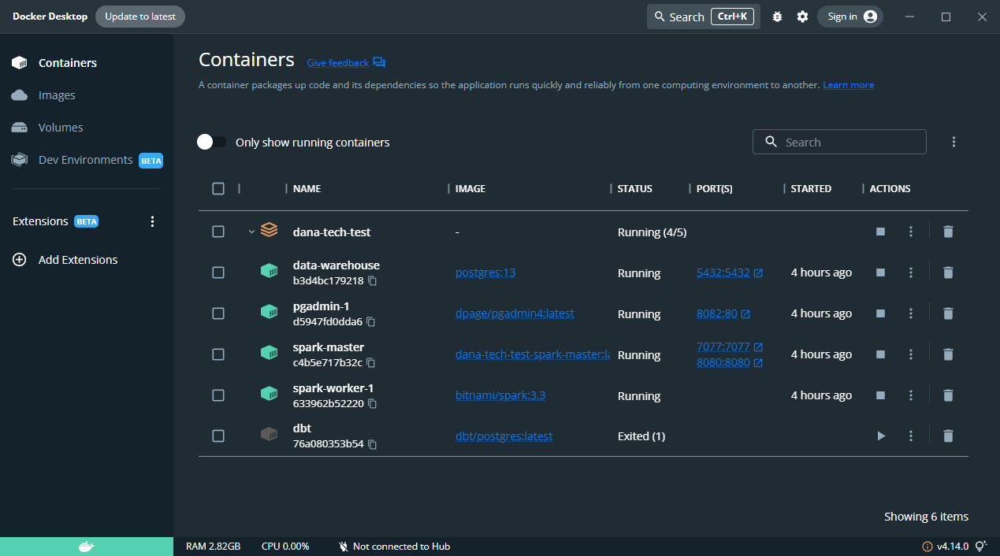
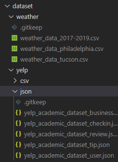
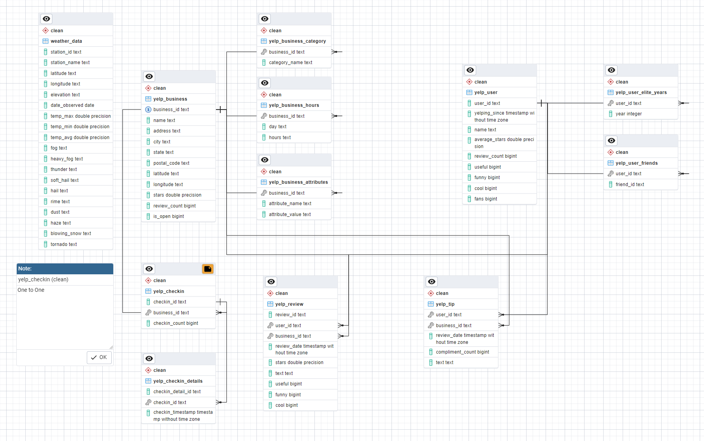
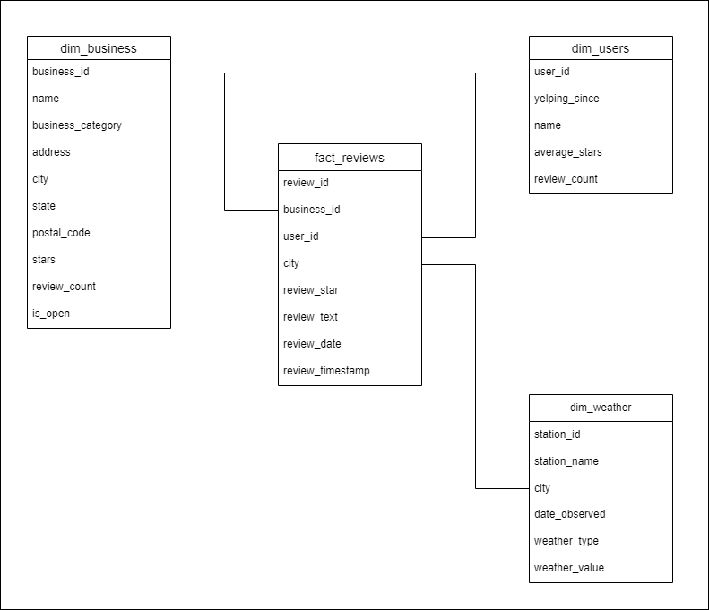

# How Weather Affect Yelp Reviews

My solution to technical test offered by DANA.

## Requirements

- Docker
- Docker compose

**NOTE:** `docker compose` command here uses Docker Compose V2, more info [here](https://docs.docker.com/compose/compose-v2/).

For Windows:

- WSL2 for Docker Desktop Backend

## Services

- Postgres 13 (as a staging database, ODS, and also a Data Warehouse).
- PGAdmin (Web Service UI for postgres).
- Spark (For processing large data)
- PySpark on Python 3.10.7 (For running spark jobs)
- dbt (Data Build Tool for transforming data in Data Warehouse).

**NOTE:** No orchestrator (e.g Apache Airflow) is used in this case for simplicity

## Infrastructure

The data pipeline is build according to the diagram below:


## Running instruction

- Clone repo.
- Change directory to the cloned repo.
- Build the images:

  ```bash
  docker compose build
  ```

- Spin up the containers.

  ```bash
  docker compose up -d
  ```

  **NOTE**: If you want to scale up the spark workers, do the following:

  ```bash
  docker compose up -d --scale spark-worker=n
  ```

  where `n` is the number of worker (default 1).

  For the worker specs, check out the [docker-compose.yaml](./docker-compose.yaml) file, and modify either of the following:

  ```yaml
  SPARK_WORKER_MEMORY=1G
  SPARK_WORKER_CORES=1
  ```

  **NOTE**: Make sure whatever machine you are running this is powerful enough if you want to scale up.





Now that the services are ready and running in the background, next run `scripts.sh` on the terminal. If using windows try to use MINGW64/Git Bash, otherwise simply check the commands inside the script and run it on the cmd step by step.

**NOTE**: Make sure to put the dataset in the respective folder, following the structure below:



## PGAdmin setup

PGAdmin can be used to check the data, but there's a need to register the server first for first time login.

- In the login page, login into PGAdmin. Email is set to `admin@admin.com` and password to `root`.
- Next click on Add New Server
- After that in the `General` tab, enter in the `Name` like below.
- Finally, click on `Connection` tab and enter in the connection credentials. Password is `root`.

The connection credential is:

```env
HOST=data-warehouse
PORT=5432
USER=root
PASSWORD=root
DB=dana
```

## ERD of the Operational Data Store (Clean Layer)



## Star Schema of the Data Warehouse



## Q&A

1. Create submission document using word and convert into pdf

    - I created the docs using Markdown instead, later converted to pdf and submitted through email. For better exploration, please use the github link below instead:

    [My Github: https://github.com/etchzel/dana-technical-test](https://github.com/etchzel/dana-technical-test).

<br>

2. Create a data architecture diagram to visualize how you will ingest the dataset into Staging, Operational Data Store (ODS), and Data Warehouse environments, so as to ultimately query the data for relationships between weather and Yelp reviews. Please provide a screenshot and put in the submission document.

    - See [infrastructure](#infrastructure) above.

<br>

3. Convert yelp dataset from json to csv using your preferred code. Make your project stand out by dockerize your project.

    - Everything in this project is dockerized. For the csv conversion check out [load_staging.py](./spark/jobs/load_staging.py), under the `Write to csv` comment.

<br>

4. Implement your data architecture diagram using your preferred datastore (local & cloud). Create staging and ODS table for each dataset.

    - Staging and ODS use postgreSQL. Check [models](./dbt/data/dbt/dana_etl/models/) for ods (clean) and dwh tables.

<br>

5. Draw an entity-relationship (ER) diagram to visualize the data structure in ODS. Provide the screen capture in submission document.

    - Check [erd image above](#erd-of-the-operational-data-store-clean-layer)

<br>

6. Load the data from file into datastore using your preferred method. In the dataset there are several file that the size is more than 1 GB, do you have any method to load large dataset into datastore ? Explain your method.

    - I used spark to utilize distributed system, although i ended up only using 1 spark worker so it took a long time, this is because of my computer low specs. For better specs, scale up the worker and increase the memory and cores, don't forget to adjust allowed memory and cores for Docker if using Windows.

<br>

7. Load data from staging data into ODS table. Do we need to clean the data first ? Explain in the submission

    - Yes there is a need to clean the data first, especially because of some nested structure, and also some unparsed unicode string.

<br>

8. In this step you need to build star schema data warehouse layer based on the data you have. Analyse the data, draw star schema diagram and create DWH layer table represent your star schema diagram Provide the screen capture in submission document.

    - See [star schema diagram](#star-schema-of-the-data-warehouse) above.

<br>

9. Migrate the data from ODS to DWH layer.

    - See [models](./dbt/data/dbt/dana_etl/models/).

<br>

10. Query the data to determine how weather affects yelp reviews.

    - Incomplete, not enough time before deadline.

<br>

11. You need to commit all the code that you write and all the query that you use into your GitHub account.

    - Check the [repo](https://github.com/etchzel/dana-technical-test) above.